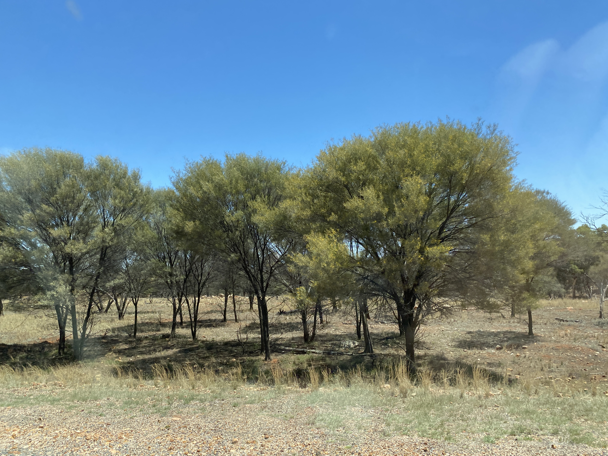

# **MUL**tivariate **G**raphical **A**nalysis in R (mulgar)

This is a companion to the book 
  [Interactive and dynamic graphics for high-dimensional data using R](https://dicook.github.io/mulgar_book/) 
  by Cook and Laa. It contains useful functions for processing data in preparation for 
  visualising with a tour. There are also several sample data sets.
  
## Getting started

Install the package from Github and load using

```
remotes::install_github("dicook/mulgar")
library(mulgar)
```

## About the name

The [mulga](https://en.wikipedia.org/wiki/Mulga_(habitat)) is an iconic landscape in Australia. It is a woodland dominated by the mulga tree (Acacia aneura). As you travel through mulga the trees look very regular, sometimes like a stand of lollipops, which is apparently due to close neighbours being clones! The wood is especially hardy, durable and resistant to pests. The climate is semi-arid and it can be found across Australia, Queensland, New South Wales, South Australia and Western Australia. This landscape is host to numerous species: red kangaroos, spinifex hopping mice, mulga parrots, dunnarts, thorny devils, bearded dragons, and pests like feral goats.



